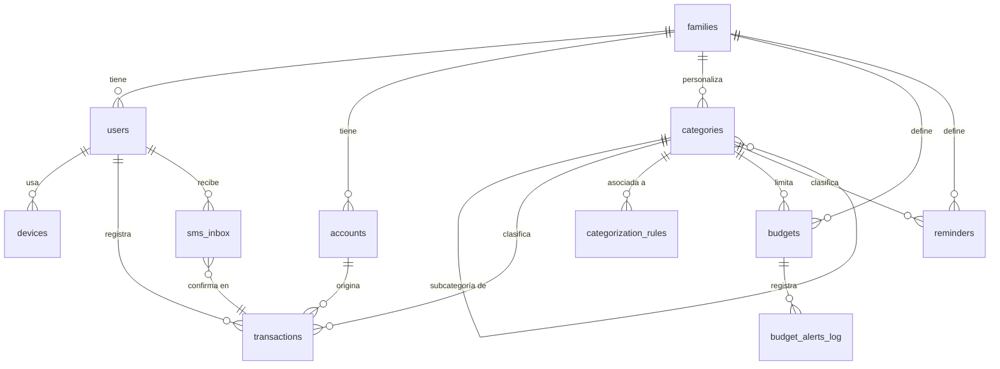

# Kipo — Esquema de base de datos

Fuente de verdad: [`database/schema.sql`](../database/schema.sql) (PostgreSQL / Supabase).
El cliente offline usa el mismo modelo en SQLite (ver notas de portabilidad al
inicio del archivo SQL).

## Diagrama entidad-relación

## Tablas

### `families` / `users` / `devices`
Una familia agrupa a sus miembros (`users`). `role` distingue `admin` (puede
editar presupuestos/categorías) de `member` y `child` (perfiles sin login,
útiles si algún día se quiere que un adolescente registre sus propios gastos).
`devices` guarda el token de push y si ese dispositivo tiene activado el
lector de SMS (`sms_reader_enabled`, solo relevante en Android).

### `categories` + `categorization_rules`
Jerarquía de 2 niveles (grupo `kind` → subcategoría), sembrada desde
`src/parsing/categoryDictionary.mjs` para que el catálogo de la base de datos
y el diccionario del parser nunca se desincronicen. `family_id = null` marca
categorías del sistema (compartidas); una familia puede añadir sus propias
subcategorías o palabras clave sin tocar código, vía `categorization_rules`.

Los 5 grupos (`kind`) mapean 1:1 con el pedido original:

| `kind` | Subcategorías por defecto |
|---|---|
| `fijo` | Vivienda, Servicios, Colegiaturas, Seguros, Cuota vehicular |
| `necesario` | Supermercado, Farmacia, Mantenimiento del hogar |
| `transporte` | Gasolina, Parqueos, Mantenimiento de auto |
| `alimentacion_fuera` | Comida rápida, Cafeterías, Pedidos a domicilio, Restaurante |
| `salidas_convivencia` | En Familia, En Pareja, Personales/Amigos |

### `transactions`
Tabla central. `source` distingue cómo se originó (`chat`, `voz`, `sms`,
`manual`, `recurrente`) y `status` si ya fue confirmada por el usuario o sigue
`pendiente` de revisión (típico de una sugerencia de SMS o de un parseo de
baja confianza). `raw_text` conserva el mensaje original — útil para auditar
al parser y para reentrenar el diccionario de categorías. `metadata` (jsonb)
guarda detalles como el `confidence` del parser o el `sms_inbox_id` de origen.

### `sms_inbox`
Cola de sugerencias detectadas por el listener de SMS (Android). Nunca escribe
directo a `transactions`: el usuario confirma o descarta desde una bandeja
dedicada, y solo entonces se crea/vincula la fila en `transactions`
(`matched_transaction_id` evita duplicados cuando el usuario ya había
registrado el mismo gasto manualmente).

### `budgets` + `budget_alerts_log`
Un presupuesto puede ser general (`category_id = null`) o por categoría/grupo
(ej. "Salidas y comida fuera" sumando `alimentacion_fuera` + `salidas_convivencia`
se modela como dos filas de presupuesto vinculadas a cada categoría, o como una
categoría "virtual" agregadora — decisión de producto, el esquema soporta ambas).
`budget_alerts_log` evita reenviar la misma alerta dos veces en el mismo mes
(constraint `unique (budget_id, period_start)`).

### `reminders`
Pagos fijos recurrentes (alquiler, colegiatura, tarjeta). `next_due_date` se
recalcula tras cada notificación según `recurrence`; una Edge Function
programada (`send-reminders`, cron diario) consulta `next_due_date - notify_days_before <= hoy`
y dispara push notifications.

### `sync_log`
Bitácora de cambios para la sincronización offline-first: cada escritura local
se encola aquí antes de subir a Postgres, y el `client_id` permite resolver
conflictos por "last-write-wins" comparando `updated_at`.

### Row Level Security (RLS)
`transactions`, `budgets`, `reminders` y `sms_inbox` tienen políticas que
limitan cada fila a la familia (o usuario, en el caso de `sms_inbox`) del
`auth.uid()` autenticado — así ninguna familia puede ver datos de otra aunque
compartan la misma base de datos Supabase.
