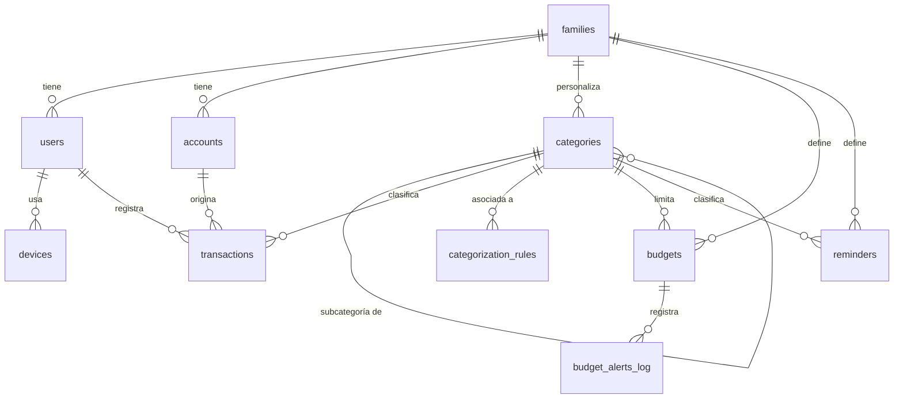

# Kipo — Esquema de base de datos

Fuente de verdad: [`database/schema.sql`](../database/schema.sql) (PostgreSQL / Supabase).
El cliente offline usa el mismo modelo en SQLite (ver notas de portabilidad al
inicio del archivo SQL).

## Diagrama entidad-relación

```mermaid
erDiagram
    families ||--o{ users : "tiene"
    families ||--o{ accounts : "tiene"
    families ||--o{ categories : "personaliza"
    families ||--o{ budgets : "define"
    families ||--o{ reminders : "define"
    users ||--o{ devices : "usa"
    users ||--o{ transactions : "registra"
    accounts ||--o{ transactions : "origina"
    categories ||--o{ categories : "subcategoría de"
    categories ||--o{ transactions : "clasifica"
    categories ||--o{ categorization_rules : "asociada a"
    categories ||--o{ budgets : "limita"
    categories ||--o{ reminders : "clasifica"
    budgets ||--o{ budget_alerts_log : "registra"
```

## Tablas

### `families` / `users` / `devices`
Una familia agrupa a sus miembros (`users`). `role` distingue `admin` (puede
editar presupuestos/categorías) de `member` y `child` (perfiles sin login,
útiles si algún día se quiere que un adolescente registre sus propios gastos).
`devices` guarda el token de push de ese dispositivo (para notificaciones,
ej. recordatorios de pago).

### `categories` + `categorization_rules`
Jerarquía de 2 niveles (grupo `kind` → subcategoría), sembrada desde
`src/parsing/categoryDictionary.mjs` para que el catálogo de la base de datos
y el diccionario del parser nunca se desincronicen. `family_id = null` marca
categorías del sistema (compartidas); una familia puede añadir sus propias
subcategorías o palabras clave sin tocar código, vía `categorization_rules`.

Los 5 grupos (`kind`) mapean 1:1 con el pedido original:

| `kind` | Subcategorías por defecto |
|---|---|
| `fijo` | Vivienda, Servicios, Colegiaturas, Seguros, Cuota vehicular |
| `necesario` | Supermercado, Farmacia, Mantenimiento del hogar |
| `transporte` | Gasolina, Parqueos, Mantenimiento de auto |
| `alimentacion_fuera` | Comida rápida, Cafeterías, Pedidos a domicilio, Restaurante |
| `salidas_convivencia` | En Familia, En Pareja, Personales/Amigos |

### `transactions`
Tabla central. `source` distingue cómo se originó (`chat`, `voz`, `manual`,
`recurrente` — `sms` se mantiene como valor histórico válido, pero ninguna
pantalla actual crea filas con ese origen, ver más abajo) y `status` si ya fue
confirmada por el usuario o sigue `pendiente` de revisión (típico de un
parseo de baja confianza, del parser local o de Kipobot). `raw_text` conserva
el mensaje original — útil para auditar al parser y para reentrenar el
diccionario de categorías. `metadata` (jsonb) guarda detalles como el
`confidence` del parser/bot con IA.

> La bandeja de SMS bancarios (tabla `sms_inbox`, permiso de Android
> `READ_SMS`/`RECEIVE_SMS`, pantalla dedicada) se quitó por completo — ver
> `supabase/migrations/0020_remove_sms_inbox.sql`. Se reemplazó por Kipobot,
> captura de gastos por chat interpretada con IA (ver
> [`NLP_PARSING.md`](./NLP_PARSING.md) §2).

### `budgets` + `budget_alerts_log`
Un presupuesto puede ser general (`category_kind = null`, suma todos los
gastos del mes) o de un grupo completo (`category_kind` = uno de los 5 `kind`
de `categories` — ej. `salidas_convivencia` suma En Familia + En Pareja +
Amigos juntos). Se referencia el grupo, no una fila puntual de `categories`,
porque un presupuesto de "Salidas y Convivencia" tiene que cubrir sus 3
subcategorías a la vez, no una sola. `budget_alerts_log` evita reenviar la
misma alerta dos veces en el mismo mes (constraint `unique (budget_id,
period_start)`).

### `reminders`
Pagos fijos recurrentes (alquiler, colegiatura, tarjeta). `next_due_date` se
recalcula tras cada notificación según `recurrence`; una Edge Function
programada (`send-reminders`, cron diario) consulta `next_due_date - notify_days_before <= hoy`
y dispara push notifications.

### `sync_log`
Bitácora de cambios para la sincronización offline-first: cada escritura local
se encola aquí antes de subir a Postgres, y el `client_id` permite resolver
conflictos por "last-write-wins" comparando `updated_at`.

### Row Level Security (RLS)
`transactions`, `budgets` y `reminders` tienen políticas que limitan cada fila
a la familia del `auth.uid()` autenticado — así ninguna familia puede ver
datos de otra aunque compartan la misma base de datos Supabase.
