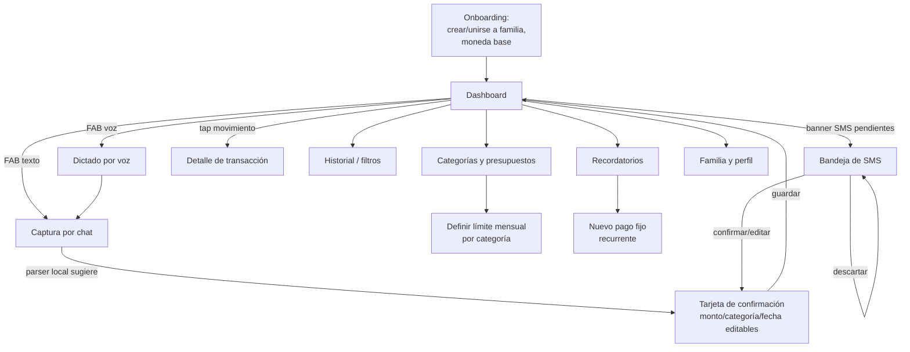

# Kipo — Flujo de pantallas

## Flujo principal



## Pantallas

### 1. Onboarding
- Crear una familia nueva o unirse con código de invitación.
- Definir moneda base y agregar el primer método de captura (activar permiso
  de SMS en Android, o explicar la alternativa de compartir manualmente en iOS).
- Invitar a los demás miembros (link/código).

### 2. Dashboard (pantalla de apertura)
Diseño limpio, información más importante arriba, sin scroll para lo esencial:

```
┌─────────────────────────────────────┐
│  Kipo                    👨‍👩‍👧 Familia │
│                                       │
│  Balance de septiembre               │
│  Ingresos $2,400   Gastos $1,180     │
│  ██████████░░░░░░░░  49% usado       │
│                                       │
│  ┌─────────────┐                     │
│  │   Dona:      │  Fijos      45%    │
│  │ Fijos/Var/   │  Variables  35%    │
│  │ Salidas      │  Salidas    20%    │
│  └─────────────┘                     │
│                                       │
│  ⏰ Próximos pagos (7 días)           │
│  • Internet — vence en 3 días  $45   │
│  • Colegiatura — vence en 6 días $300│
│                                       │
│  Últimos movimientos                 │
│  🍔 Almuerzo con esposa      -$35    │
│  ⛽ Gasolina                  -$40    │
│  🍺 Cervezas con amigos       -$20   │
│                                       │
│                              ( + )   │ ← FAB: teclado / micrófono
└─────────────────────────────────────┘
```

- **Balance del mes**: ingresos vs. gastos totales, con barra de progreso del
  presupuesto general si existe.
- **Distribución visual**: dona o barras — Fijos / Necesarios+Transporte
  ("Variables") / Alimentación fuera+Salidas ("Ocio y convivencia").
- **Alertas de próximos pagos**: recordatorios con `next_due_date` dentro de 7
  días, ordenados por urgencia.
- **Últimos movimientos**: 5–8 transacciones recientes, con ícono por
  categoría y color por tipo (fijo/variable/salida).
- **FAB (botón flotante)**: acción primaria de la app — un tap abre el chat de
  texto, mantener presionado activa dictado por voz.

### 3. Captura por chat
Interfaz tipo mensajería: el usuario escribe (o dicta) una línea, el parser
local responde en menos de 100ms con una **tarjeta de confirmación** inline
(no un formulario nuevo): monto, categoría (chip editable con las demás
opciones a un tap), fecha, y comercio si se detectó. Confirmar guarda al
instante en SQLite local; el historial del chat queda como bitácora de
gastos capturados ese día.

### 4. Bandeja de SMS pendientes
Lista de sugerencias detectadas en segundo plano, cada una con: monto,
comercio, banco/patrón detectado, y dos acciones rápidas — **Confirmar**
(abre la misma tarjeta de confirmación, precargada) o **Descartar**. Un
badge en el Dashboard indica cuántas hay pendientes.

### 5. Historial de transacciones
Filtros por rango de fecha, categoría, miembro de la familia y fuente
(chat/sms/manual). Búsqueda por texto libre sobre `merchant`/`description`.

### 6. Categorías y presupuestos
Lista de las 5 categorías fijas del esquema con sus subcategorías; cada una
puede tener un límite mensual. Al superar el `alert_threshold_pct` (por
defecto 80%) se dispara una notificación push ("Vas en 85% del presupuesto de
Salidas este mes").

### 7. Recordatorios
Lista de pagos fijos recurrentes con su próxima fecha de vencimiento; alta/edición
rápida (nombre, monto opcional, día del mes, cuántos días antes avisar).

### 8. Familia y perfil
Miembros de la familia y su rol, código de invitación, moneda, y activar/desactivar
el lector de SMS por dispositivo (Android).

## Principio de interacción transversal

Ninguna pantalla de captura (chat, SMS, voz) navega a un formulario separado
para confirmar: la confirmación siempre es una **tarjeta inline editable**
sobre la misma pantalla, para no romper el flujo de "escribir y seguir". Los
formularios completos (nueva categoría, nuevo presupuesto, nuevo recordatorio)
sí son pantallas propias, porque son acciones de configuración poco frecuentes.
